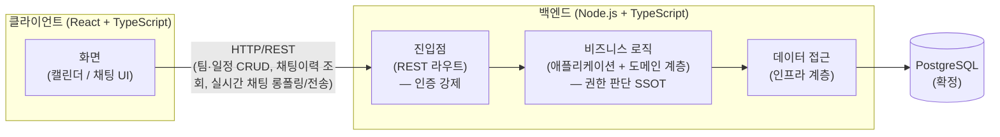

# Team CalTalk 기술 아키텍처 다이어그램

## 문서 정보

| 항목 | 내용 |
|---|---|
| 버전 | v1.2 |
| 작성일 | 2026-09-07 |
| 최종수정일 | 2026-09-14 |
| 작성자 | Team CalTalk 아키텍처 리뷰 |
| 근거 문서 | [1-domain-definition.md](./1-domain-definition.md) (v1.4) — 도메인 용어, 액터/권한 SSOT [2-PRD.md](./2-PRD.md) — MVP 범위 [3-User-scenarios.md](./3-User-scenarios.md) — 실사용 흐름 [4-project-structure.md](./4-project-structure.md) (v1.2) — 확정 스택(FE/BE/DB), 레이어 구조 (본 다이어그램의 1차 근거) [6-tech-stack.md](./6-tech-stack.md) (v1.0) — DB(PostgreSQL) 비교·결정 근거 |

**변경 이력**

| 버전 | 일자 | 변경 내용 |
|---|---|---|
| v1.0 | 2026-09-07 | 최초 작성 |
| v1.1 | 2026-09-07 | 6-tech-stack.md의 비교 분석 결과를 반영하여 DB 노드를 "PostgreSQL(작업 가정)"에서 "PostgreSQL(확정)"으로 갱신 |
| v1.2 | 2026-09-14 | 실시간 채팅(UC5)을 WebSocket에서 REST 롱폴링으로 전환(4-project-structure.md v1.2와 동기화) — 클라이언트-백엔드 연결을 HTTP/REST 단일 채널로 단순화 |

본 문서는 Team CalTalk 시스템을 **최대한 단순화한 상위 수준(high-level) 아키텍처 뷰**이다. 파일/모듈 단위의 세부 구조나 API 목록을 다루는 상세 기술 설계 문서가 아니며, 전체 그림을 한눈에 파악하기 위한 개요임을 밝힌다.

## 아키텍처 다이어그램

## 범례 / 설명

- **클라이언트(React + TypeScript)**: 캘린더 화면과 일정-채팅 연동 UI를 렌더링하고 사용자 입력을 받는 단일 프런트엔드 애플리케이션.
- **백엔드 진입점**: HTTP 라우트를 아우르는 요청 수신 지점. 인증(UC1)은 라우트 미들웨어에서 우회 불가능하게 강제된다. 실시간 채팅(UC5)도 별도 프로토콜/핸드셰이크 없이 이 지점을 그대로 통과한다(v1.2, WebSocket에서 REST 롱폴링으로 전환).
- **비즈니스 로직(애플리케이션+도메인)**: 유스케이스 오케스트레이션과 도메인 규칙(권한, 일정 충돌, 변경 요청 승인 등)이 위치. 4장 권한 SSOT 판단이 이 한 곳에서만 이루어진다.
- **데이터 접근(인프라)**: 도메인이 정의한 인터페이스를 구현하여 실제 DB 접근을 담당.
- **PostgreSQL**: 팀/일정/채팅/변경요청 데이터를 저장하는 데이터베이스([6-tech-stack.md](./6-tech-stack.md) 4장 비교 분석에 따라 확정).
- **HTTP/REST 연결**: 팀·일정·변경요청 CRUD, 채팅 이력의 페이지네이션 조회(UC8), 실시간 채팅 롱폴링 수신 및 전송(UC5)에 모두 사용되는 단일 채널.

## 참고

- 백엔드 내부의 4개 레이어(프레젠테이션/애플리케이션/도메인/인프라)에 대한 상세 구조, 폴더 배치, 네이밍 규칙은 [4-project-structure.md](./4-project-structure.md)를 참조한다. 본 다이어그램은 그중 큰 흐름만 3단계로 단순화하여 표현한 것이다.
- 캐시, 메시지 큐, CDN, 로드밸런서 등은 현재 확정된 아키텍처 요소가 아니므로 본 다이어그램에 포함하지 않았다.
- 실시간 채팅을 WebSocket에서 REST 롱폴링으로 전환한 배경은 [4-project-structure.md](./4-project-structure.md) 5.4절을 참조한다(Vercel 서버리스 함수 배포와 상시 연결 WebSocket의 구조적 불일치).
