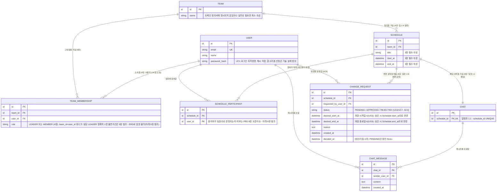

# Team CalTalk ERD (Entity-Relationship Diagram)

## 문서 정보

| 항목 | 내용 |
|---|---|
| 버전 | v1.2 |
| 작성일 | 2026-09-07 |
| 최종수정일 | 2026-09-07 |
| 작성자 | Team CalTalk 아키텍처 리뷰 |
| 근거 문서 | [1-domain-definition.md](./1-domain-definition.md) (v1.4) — 도메인 용어집(3장), 액터/권한 SSOT(4장), 팀 라이프사이클(5장), 개념 관계 요약(6장) [2-PRD.md](./2-PRD.md) (v1.0) — UC1-UC9, SC1-SC4, 오픈 이슈(8장) [4-project-structure.md](./4-project-structure.md) (v1.1) 3.2절 — 도메인 용어→코드 용어 고정 매핑 [6-tech-stack.md](./6-tech-stack.md) (v1.0) 4장 — 데이터베이스를 PostgreSQL로 확정한 근거(관계형 구조·참조 무결성, SC3 트랜잭션 일관성) |

**변경 이력**

| 버전 | 일자 | 변경 내용 |
|---|---|---|
| v1.0 | 2026-09-07 | 최초 작성 |
| v1.1 | 2026-09-07 | `USER`에 `password_hash` 추가(UC1 인증 구현 시 자격증명 저장 컬럼 누락 — 8-execution-plan.md 수립 중 백엔드 트랙이 발견한 블로커 해소). 도메인/관계/기타 엔티티는 변경 없음 |
| v1.2 | 2026-09-07 | `CHANGE_REQUEST`에 `desired_start_at`/`desired_end_at` 추가(swagger.json ↔ docs 정합성 감사 중 발견된 블로커 — 승인 시 Schedule을 갱신할 목표 값을 저장할 컬럼이 없었음, UC6/UC7/SC3 해소). 그 외 엔티티는 변경 없음 |

---

## 1. 개요

[6-tech-stack.md](./6-tech-stack.md) 4장은 "팀/일정/채팅/변경요청 간의 명확한 관계형 구조"와 "SC3가 요구하는 트랜잭션 일관성"을 근거로 데이터베이스를 PostgreSQL로 확정했다. 본 문서는 그 결정을 실제 스키마 수준에서 처음으로 구체화한 산출물이며, [1-domain-definition.md](./1-domain-definition.md) 6장의 개념 관계 요약(팀 1:N 일정, 일정 1:1 채팅, 일정 1:N 변경요청, 사용자 1:N 팀 소속)을 엔티티-관계 모델로 번역한다.

본 문서는 ERD이며, 인덱스 전략·파티셔닝 구체 DDL·API 설계는 다루지 않는다(파티셔닝은 [6-tech-stack.md](./6-tech-stack.md) 4.2절 (c)에서 이미 참조됨). ID 컬럼의 구체적 데이터 타입(UUID vs 정수 시퀀스 등)도 세부 기술 설계 사항이므로 본 문서에서는 자리표시자 타입(`id`)으로만 표기하고 확정하지 않는다.

도메인 정의서·PRD에 근거가 없는 엔티티(알림, 파일첨부 등)는 Out-of-scope이며 모델링하지 않는다.

---

## 2. 엔티티 요약

| 엔티티 | 도메인 근거 | 코드 용어 매핑 ([4-project-structure.md](./4-project-structure.md) 3.2) |
|---|---|---|
| `User` | 3장 "인증" — 인증되는 사용자. `password_hash`는 UC1 구현에 필요한 자격증명 저장 컬럼(v1.1 추가) | — (인증 대상 사용자 자체는 3.2 용어표에 별도 항목 없음. `Auth`는 인증 절차를 가리키는 용어이며, `User`는 그 대상 엔티티) |
| `Team` | 3장 "팀", 4장 | `Team` |
| `TeamMembership` | 4장 "사용자는 하나 이상의 팀에 속할 수 있으며, 팀별로 역할이 부여된다", 6장 "사용자 1:N 팀 소속(역할 포함)" | 역할 값: `LEADER` / `MEMBER` (`TeamLeader`/`TeamMember`) |
| `Schedule` | 3장 "일정" 필수 속성(제목/시작일시/종료일시/참여자 목록), 6장 "팀 1:N 일정" | `Schedule` |
| `ScheduleParticipant` | 3장 "참여자 목록" | — (별도 코드 용어 미지정, `Schedule`의 참여자 관계로 표현) |
| `Chat` | 3장 "채팅(대화)", 6장 "일정 1:1 채팅(이력)" | `Chat` |
| `ChatMessage` | 3장 "채팅(대화)" | `ChatMessage` |
| `ChangeRequest` | 3장 "변경 요청", 6장 "일정 1:N 변경 요청", UC6/UC7, SC3. `desired_start_at`/`desired_end_at`은 UC6 "희망 시간"에 대응하며 승인 시 이 값으로 Schedule을 갱신(v1.2 추가) | `ChangeRequest` (상태: `PENDING`/`APPROVED`/`REJECTED`) |

---

## 3. ERD (Mermaid)

---

## 4. 관계 설명

| 관계 | 카디널리티 | 도메인 정의서 근거 |
|---|---|---|
| User — TeamMembership | 1 : N | 4장 "한 사용자는 하나 이상의 팀에 속할 수 있으며, 팀별로 역할이 부여된다" |
| Team — TeamMembership | 1 : N | 6장 "사용자 1 : N 팀 소속(역할 포함)"을 Team 쪽에서 본 표현 |
| Team — Schedule | 1 : N | 6장 "팀 1 : N 일정" |
| Schedule — ScheduleParticipant | 1 : N | 3장 일정의 필수 속성 "참여자 목록" |
| User — ScheduleParticipant | 1 : N | 3장 "참여자 목록"(참여자는 User) |
| Schedule — Chat | 1 : 1 | 6장 "일정 1 : 1 채팅(이력)" |
| Chat — ChatMessage | 1 : N | 3장 "채팅(대화)"은 이력이 남는 커뮤니케이션 수단 — 메시지 다수를 포함 |
| User — ChatMessage | 1 : N | 4장 "팀장과 팀원 모두 자신이 속한 팀의 일정 채팅에 메시지를 자유롭게 작성·열람할 수 있다" |
| Schedule — ChangeRequest | 1 : N | 6장 "일정 1 : N 변경 요청" |
| User — ChangeRequest | 1 : N | 3장 "변경 요청"은 팀원이 발신(UC6), 요청자는 User |

---

## 5. ERD로 표현되지 않는 비즈니스 규칙

관계형 ERD 표기법(카디널리티, FK)만으로는 아래 규칙들을 표현할 수 없다. 실제 구현은 DB 제약(부분 유니크 인덱스 등) 또는 애플리케이션/도메인 계층([4-project-structure.md](./4-project-structure.md) 2.3절)에서 강제해야 한다.

- **팀당 정확히 1명의 팀장** (4장 불변조건, 5장 팀 라이프사이클): `TeamMembership.role = 'LEADER'`인 행이 팀당 정확히 1개여야 한다는 "개수 제약"은 단순 FK/카디널리티로 표현할 수 없다. PostgreSQL 구현 시 `team_id`에 대해 `role = 'LEADER'`인 행만 대상으로 하는 부분 유니크 인덱스(partial unique index)로 "팀당 최대 1명"까지는 강제할 수 있으나, "정확히 1명(0명도 허용 안 됨)"이라는 하한 제약은 DB 제약만으로는 강제할 수 없고, 팀 생성·위임·해체 절차(`domain/team/team-lifecycle.rules.ts`, [4-project-structure.md](./4-project-structure.md) 6.2)에서 트랜잭션으로 함께 보장해야 한다.
- **변경 요청 승인 시에만 Schedule 갱신** (SC3): ERD는 `ChangeRequest`와 `Schedule` 간 FK 관계만 표현할 뿐, "`status`가 `APPROVED`로 전이되는 트랜잭션 안에서만 `Schedule.title`/`start_at`/`end_at`이 갱신된다"는 시점적·절차적 규칙은 표현 대상이 아니다. 애플리케이션 계층의 `approve-change-request.usecase.ts`([4-project-structure.md](./4-project-structure.md) 6.2)가 단일 트랜잭션으로 이를 보장해야 한다.
- **일정 삭제와 채팅 이력의 조건부 보존** (6장 4문단, SC2): 팀장이 일정을 삭제해도 `Chat`/`ChatMessage`는 삭제되지 않고 보존되어야 하지만, 팀 해체 시에는 해당 팀의 모든 `Schedule`과 `Chat`이 함께 삭제되어야 한다. 이는 방향에 따라 다르게 동작하는 조건부 CASCADE 정책이라 단일 FK의 `ON DELETE CASCADE`(항상 적용) 한 가지로는 표현할 수 없다. 구현 시에는 (a) `Schedule` 삭제는 `Chat.schedule_id` FK에 CASCADE를 걸지 않거나 `Schedule`을 소프트 삭제(예: `deleted_at`)로 처리하여 참조를 보존하고, (b) 팀 해체 시에만 애플리케이션 트랜잭션이 해당 `team_id`에 속한 `Schedule`·`Chat`·`ChatMessage`를 명시적으로 함께 삭제하는 별도 절차(`team-lifecycle.rules.ts`)로 분리해야 한다.

---

## 6. 오픈 이슈에 따른 임시 가정

[2-PRD.md](./2-PRD.md) 8장에 정리된 오픈 이슈 중 본 ERD 설계에 실제로 영향을 주는 항목은 임의로 답을 정하지 않고, 아래와 같이 스키마 상의 임시 가정만 남긴다. 확정된 결정이 아니므로 추후 도메인 정의서/PRD가 갱신되면 본 ERD도 함께 갱신되어야 한다.

- **재요청과 이전 요청의 연결** (PRD 8장): `ChangeRequest`에 이전 요청을 가리키는 자기참조 컬럼(예: `previous_request_id`)을 두지 않았다. 거절 후 재요청은 우선 완전히 새로운 독립적 `ChangeRequest` 행으로 취급한다. 재요청-이전요청 연결 방식이 정의되면 자기참조 FK 추가를 검토해야 한다.
- **팀원 탈퇴 시 기존 일정 참여자 처리** (PRD 8장): 탈퇴는 `TeamMembership` 행의 삭제/비활성화로 표현되지만, 이미 등록된 `ScheduleParticipant` 행은 이에 연동해 자동 삭제(CASCADE)하지 않는 것으로 가정했다(과거 일정 이력을 임의로 훼손하지 않기 위함). 탈퇴 시 참여자 목록 처리 방침이 정의되면 이 가정을 재검토해야 한다.
- **일정 참여자의 범위** (PRD 8장): `ScheduleParticipant.user_id`는 `TeamMembership`을 경유하지 않고 `User`를 직접 참조한다. 즉, "참여자가 해당 팀의 팀원으로 한정되는지"를 FK/스키마 수준에서 강제하지 않았다. 참여자 범위가 명문화되면 `TeamMembership`을 참조하는 복합 FK 또는 애플리케이션 레벨 검증 추가를 검토해야 한다.

아래 두 오픈 이슈는 본 ERD의 테이블/관계 구조 자체에는 영향을 주지 않아 별도 스키마 변경 없이 참고로만 남긴다.

- **일정 충돌 감지의 범위**(같은 팀 내 한정 vs 사용자가 속한 다른 팀 포함, PRD 8장): `ScheduleConflict`는 저장되는 엔티티가 아니라 `Schedule`+`ScheduleParticipant` 데이터를 조회해 겹침을 판정하는 파생 로직([4-project-structure.md](./4-project-structure.md) `schedule-conflict.ts`)이므로 ERD에 별도 테이블로 포함하지 않았다.
- **팀장 위임의 수락 절차**(일방적 지정 vs 동의 필요, PRD 8장): 스키마상 위임은 `TeamMembership.role`의 갱신(기존 팀장 → `MEMBER`, 대상 팀원 → `LEADER`)으로 표현되며, 수락 절차 필요 여부는 이 갱신이 "언제" 일어나는지에 대한 애플리케이션 절차의 문제이지 스키마 구조의 문제가 아니다.

---

## 7. 참고 (범위 제한)

- 인덱스 전략(부분 유니크 인덱스 제외), 파티셔닝 구체 DDL(예: `ChatMessage`의 생성일자 기준 RANGE 파티셔닝, [6-tech-stack.md](./6-tech-stack.md) 4.2절 (c) 참조)은 본 ERD의 범위 밖이며 이후 기술 설계 단계에서 다룬다.
- API 엔드포인트 설계는 본 ERD의 범위 밖이다([4-project-structure.md](./4-project-structure.md) 6.2절의 라우트 구조 참조).
- 도메인/PRD에 근거가 없는 엔티티(알림, 파일첨부, 외부 캘린더 연동 등)는 Out-of-scope이며 모델링하지 않았다(도메인 정의서 8장, PRD 7장 참조).
