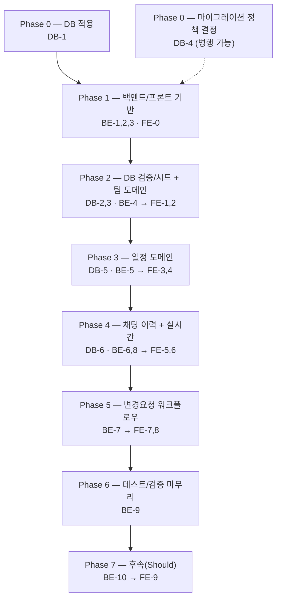

# Team CalTalk 실행 계획 (DB / 백엔드 / 프론트엔드)

## 문서 정보

| 항목 | 내용 |
|---|---|
| 버전 | v1.2 |
| 작성일 | 2026-09-09 |
| 최종수정일 | 2026-09-16 |
| 작성자 | Team CalTalk 실행계획 수립 |
| 근거 문서 | [1-domain-definition.md](./1-domain-definition.md) (v1.4) [2-PRD.md](./2-PRD.md) (v1.0) [3-User-scenarios.md](./3-User-scenarios.md) [4-project-structure.md](./4-project-structure.md) (v1.1) [5-arch-diagram.md](./5-arch-diagram.md) [6-tech-stack.md](./6-tech-stack.md) (v1.0) [database/schema.sql](../database/schema.sql) — 데이터 모델의 실질적 근거(구 7-erd.md 대체) [swagger/swagger.json](../swagger/swagger.json) — API 계약의 실질적 근거(v1.1부터 다시 존재 및 유지 중) |

**변경 이력**

| 버전 | 일자 | 변경 내용 |
|---|---|---|
| v1.0 | 2026-09-09 | 최초 작성 |
| v1.1 | 2026-09-14 | DB-1~DB-6·BE-1~BE-10·FE-0~FE-9 전체 구현 및 테스트 완료를 반영해 완료 조건 체크박스를 전부 [x]로 갱신. `swagger/swagger.json`이 재도입되어 실제 API 계약으로 유지되고 있음을 반영(0장 "이전 실행계획과의 차이"/"추가 안내" 문단 갱신). 실사용 중 발견되어 BE-4/BE-7에 추가된 엔드포인트(`GET /teams/{teamId}`, `GET /teams/{teamId}/join-requests`, `GET /schedules/{scheduleId}/change-requests`) 반영 및 "7. 구현 후 발견된 갭" 절 신설(2026-09-14 브라우저 E2E 검증 결과, `.scratch_issues/dev-log.md` 근거) |
| v1.2 | 2026-09-16 | 2026-09-16 브라우저 수동 테스트(성능 테스트 포함)에서 추가로 발견된 갭 4건을 "8. 2026-09-16 발견된 추가 갭" 절로 신설: (1) 팀 ID를 팀장이 팀원에게 전달할 UI 부재 → `TeamIdCopyButton.tsx` 추가, (2) `GET /teams/{teamId}` 보완 이후에도 가입 승인 후 팀원 화면이 자동 전환되지 않던 잔여 갭 → `JoinTeamForm.tsx` 자동 승인 감지 폴링 + 캘린더 자동 이동, (3) 채팅 롱폴링에서 `createdAt` 밀리초 절삭으로 인한 무한 재수신 폭주(BE-8 완료조건이 전제한 "정상 동작"이 실제로는 폭주였음) → `chat.repository.impl.ts`가 커서/표시값 모두 마이크로초 정밀도로 통일, (4) 일정 수정 폼이 채팅 패널에 z-index로 가려지던 버그 및 캘린더에서 채팅 없이 직접 수정/삭제할 수단 부재 → z-index 수정 + `ScheduleChip.tsx` 수정/삭제 아이콘 추가(`docs/8-wireframes.md` 2.2/2.7 동기화) |

## 0. 개요

본 문서는 `docs/` 디렉토리의 설계 문서와, 이미 성숙한 산출물인 `database/schema.sql`을 근거로 데이터베이스/백엔드/프론트엔드 3개 트랙의 실행 계획을 정리한 것이다. 각 트랙은 해당 분야 전문 서브에이전트(postgres-pro, backend-developer, frontend-developer)가 병렬로 수립했으며, 본 문서는 그 결과를 종합하고 트랙 간(cross-track) 의존성과 실행 순서를 정리한다. **DB-1~DB-6, BE-1~BE-10, FE-0~FE-9 전체가 구현 및 테스트 완료된 상태이며(아래 체크박스 참조), 본 문서는 이제 계획 문서 겸 완료 기록으로 기능한다.**

**이전 실행계획과의 차이**: 이전에 존재했던 `docs/7-erd.md`, `docs/8-execution-plan.md`, `docs/9-wireframes.md`는 저장소에서 삭제되었다. 데이터 모델은 `database/schema.sql`이 대신하며, `team_join_requests` 테이블 추가 등 이후 구현 과정에서 계속 갱신되어 왔다. 백엔드 태스크 ID 일부(BE-1, BE-2, BE-4, BE-5, BE-6)는 당시 (구)`swagger/swagger.json` 설명문에 이미 인용되어 있던 번호를 그대로 유지했다.

**추가 안내(2026-09-14 갱신)**: 본 문서 작성 당시 `swagger/swagger.json`이 일시적으로 저장소에서 삭제되어 있었으나, 이후 백엔드 구현과 함께 다시 작성되어 현재까지 유지·확장되고 있다. 즉 swagger.json은 더 이상 "설계 의도 기록"이 아니라 **API 계약의 실질적 근거(실제 스펙 파일)**이다. 아래 각 태스크의 완료 조건에 등장하는 엔드포인트 경로/필드명은 실제 구현·swagger.json과 합치하며, 구현 과정에서 새로 추가된 엔드포인트는 각 태스크 절과 "7. 구현 후 발견된 갭"에 반영했다.

**범위 구분**: PRD 5장 기준 Must(MVP) = UC1-UC8 + 팀 라이프사이클, Should(후속) = UC9(일정 충돌 감지). 프론트엔드는 FE-0~FE-8, 백엔드는 BE-1~BE-9가 Must이며, DB-1~DB-6은 전부 MVP 착수의 전제 조건이다. FE-9/BE-10이 Should이며, 이 역시 구현 완료되었다.

---

## 1. 단계별 실행 순서 (Phase Roadmap)

- **Phase 0**: DB-1(schema.sql 적용)이 모든 것의 최초 선행 조건. DB-4(마이그레이션 정책 결정)는 스키마 변경이 다시 필요해지기 전에만 끝내면 되므로 병행 가능.
- **Phase 1**: BE-1(스캐폴딩)→BE-2(인증)→BE-3(권한 SSOT)이 백엔드 기반이며, FE-0(프론트 스캐폴딩)은 독립적으로 병행 가능.
- **Phase 2**: DB-2(제약/캐스케이드 검증)·DB-3(시드 데이터)는 DB-1 이후 병행 가능. BE-4(팀 라이프사이클)는 BE-2/BE-3 이후 착수, 완료 시 FE-1(인증 화면)·FE-2(팀 관리 UI) 착수 가능.
- **Phase 3**: DB-5(SC1 인덱스 검증)는 DB-3 이후. BE-5(일정 CRUD)는 BE-3/BE-4 이후, 완료 시 FE-3(캘린더 조회)·FE-4(일정 폼) 착수 가능.
- **Phase 4**: DB-6(UC8 페이지네이션 검증)는 DB-3 이후. BE-6(채팅 이력 REST)은 BE-4/BE-5 이후, BE-8(WebSocket 게이트웨이)은 BE-2/BE-3/BE-6 이후. 완료 시 FE-5(채팅 패널+WS)·FE-6(이력 페이지네이션) 착수 가능.
- **Phase 5**: BE-7(변경요청 워크플로우, SC3 핵심)은 BE-3/BE-5/BE-6 이후. 완료 시 FE-7(요청 제출)·FE-8(승인/거절) 착수 가능.
- **Phase 6**: BE-9(테스트 인프라·SC1-4 종합 검증)는 BE-2~BE-8 전체 완료 후 — MVP 마무리.
- **Phase 7(Should)**: BE-10(충돌 감지)은 BE-5/BE-9 이후, FE-9(충돌 배너)는 FE-4 및 BE-10 이후. MVP 배포를 막지 않는다.

---

## 2. 데이터베이스 트랙 (DB-1 ~ DB-6)

> 담당: postgres-pro | 전제: `database/schema.sql`(v1.3)은 이미 성숙한 DDL이며, 로컬 PostgreSQL 17.6 인스턴스는 reachable하나 스키마 미적용 상태.

### DB-1. schema.sql을 로컬 Postgres 인스턴스에 적용 및 기본 검증

**완료 조건**
- [x] `psql -d <db> -f database/schema.sql`이 오류 없이 완료된다
- [x] `SELECT extname FROM pg_extension WHERE extname='pgcrypto';`로 pgcrypto 확장 설치 확인
- [x] 8개 테이블이 모두 존재함을 `\dt`/information_schema.tables로 확인
- [x] 모든 UNIQUE/CHECK 제약(`uq_users_email`, `ck_team_memberships_role`, `uq_team_memberships_team_user`, `uq_team_memberships_one_leader_per_team`, `uq_chats_schedule_id`, `ck_change_requests_status`)이 `\d <table>`에 존재함을 확인
- [x] 모든 인덱스(`ix_team_memberships_team_id/user_id`, `ix_schedules_team_id`, `ix_schedule_participants_schedule_id/user_id`, `ix_chat_messages_chat_id`, `ix_chat_messages_chat_id_created_at`, `ix_change_requests_schedule_id`)가 존재함을 확인
- [x] 8개 테이블 PK 모두에 `gen_random_uuid()` DEFAULT가 적용되어 있음을 확인
- [x] 재적용이 필요할 경우의 절차(스키마 초기화 후 재실행)가 기록된다

**의존성**
- [x] 없음 (최초 시작 태스크)

**예상 규모**: S

---

### DB-2. 제약조건 및 카스케이드 동작 통합 검증

**완료 조건**
- [x] 동일 team_id로 2번째 LEADER row INSERT 시 부분 유니크 인덱스 위반으로 실패 확인
- [x] 동일 team_id로 여러 MEMBER row INSERT는 정상 성공 확인
- [x] `schedules.deleted_at` UPDATE 전후로 연결된 chats/chat_messages row 수가 변하지 않음을 확인
- [x] 테스트 team을 `DELETE FROM teams`로 삭제 시 해당 팀의 schedules/schedule_participants/chats/chat_messages/change_requests가 모두 함께 삭제됨을 확인
- [x] 동일 schedule_id로 2번째 chats row INSERT 시 위반으로 실패 확인
- [x] `change_requests.status`→APPROVED + 대상 schedules 갱신을 단일 트랜잭션으로 실행 시 둘 다 커밋됨을 확인
- [x] 동일 트랜잭션 중 의도적 오류로 ROLLBACK 시 두 값 모두 이전 상태 유지 확인
- [x] 검증에 사용한 테스트 데이터는 종료 시 정리되어 잔여 데이터를 남기지 않는다

**의존성**
- [x] DB-1

**예상 규모**: M

---

### DB-3. 개발용 시드/픽스처 데이터셋 작성

**완료 조건**
- [x] 시드 스크립트가 schema.sql 적용 직후 바로 실행 가능하다
- [x] 팀이 최소 2개 이상, 각 팀은 정확히 1명의 LEADER와 1명 이상의 MEMBER를 가진다
- [x] 하나의 팀에 과거(1년 이상 이전)/현재/미래(1년 이상 이후) 일정이 각각 최소 1건씩 존재한다
- [x] `deleted_at`이 채워진 schedules row가 최소 1건 존재한다
- [x] 삭제되지 않은 모든 schedules row는 정확히 1개의 chats row를 가진다
- [x] 최소 1개 일정의 chat_messages가 300건 이상 시간순으로 생성되어 있다
- [x] change_requests가 PENDING/APPROVED/REJECTED 각각 최소 1건씩, desired_start_at/end_at 모두 채워져 있다
- [x] 재실행 절차(정리 후 재적재 또는 안내 주석)가 문서화되어 있다

**의존성**
- [x] DB-1

**예상 규모**: M

---

### DB-4. 마이그레이션 컨벤션 도입 여부 판단

**판단**: 정식 마이그레이션 프레임워크(Prisma Migrate 등)는 지금 도입하지 않는다 — ORM이 아직 미확정이고 CLAUDE.md의 오버엔지니어링 금지 원칙에 반한다. 기존 "단일 파일 + 상단 변경이력 표" 관행을 유지하되, 이미 적용된 환경에 증분 변경을 반영할 때는 변경이력 주석에 실행할 ALTER 문을 병기하는 최소 규칙만 확정한다.

**완료 조건**
- [x] 프레임워크 미도입 판단과 근거(ORM 미결정, MVP 단일 환경, 오버엔지니어링 금지)가 명문화된다
- [x] "단일 파일 + 변경이력 표" 유지 결정과 증분 변경 절차(ALTER 문 병기)가 명문화된다
- [x] 재검토 트리거(ORM 확정 시점, 환경 2개 이상으로 증가하는 시점)가 명시된다
- [x] 결정 내용이 schema.sql의 "근거 문서" 섹션에 반영되어 CLAUDE.md의 과거 참조를 대체한다

**의존성**
- [x] 없음 (다만 스키마 변경이 다시 필요해지기 전에 끝내는 것이 바람직함)

**예상 규모**: S

---

### DB-5. SC1 무제한 캘린더 조회 쿼리/인덱스 검증

**완료 조건**
- [x] DB-3 시드 데이터 기준 `WHERE team_id=$1 AND deleted_at IS NULL ORDER BY start_at` 쿼리의 `EXPLAIN ANALYZE` 결과가 기록된다
- [x] `ix_schedules_team_id` 사용 여부(Index/Bitmap Scan) 또는 Seq Scan 여부가 확인·기록된다
- [x] deleted_at 필터가 Index Cond가 아닌 추가 Filter로 처리되는지 확인된다
- [x] 소프트 삭제된 일정이 결과에서 실제로 제외됨을 확인한다
- [x] 다른 팀의 일정이 결과에 섞이지 않음을 확인한다
- [x] 복합/부분 인덱스 추가 필요 여부 판단과 근거가 기록되며, 필요 시에만 후속 작업으로 분리한다(이번 작업에서 DDL 직접 변경 안 함)

**의존성**
- [x] DB-1
- [x] DB-3

**예상 규모**: S

---

### DB-6. UC8 채팅 이력 페이지네이션 쿼리/인덱스 검증

**완료 조건**
- [x] schedule_id → chat_id 조회가 `uq_chats_schedule_id` 유니크 인덱스로 단일 row를 즉시 찾는지 확인된다
- [x] cursor 없는 첫 페이지 쿼리의 EXPLAIN ANALYZE에서 `ix_chat_messages_chat_id_created_at` 사용이 확인된다
- [x] cursor 있는 중간 페이지 쿼리에서도 동일 인덱스 사용이 확인된다
- [x] limit=50으로 300건을 순회했을 때 총 300건이 정확히 1회씩만 나타나며 순서가 유지됨을 확인한다
- [x] 동시각 메시지 존재 시 cursor 페이지네이션에서 행 누락/중복 위험이 있는지 확인하고, 발견되면 위험요소로 기록한다(tie-breaker 필요 여부 판단, DDL 변경은 범위 밖)

**의존성**
- [x] DB-1
- [x] DB-3

**예상 규모**: M

---

## 3. 백엔드 트랙 (BE-1 ~ BE-10)

> 담당: backend-developer | 스택: Node.js + TypeScript + Express | 구조: `docs/4-project-structure.md` 6.2절 준수 | API 계약: 계획 수립 당시 `swagger/swagger.json`(현재 삭제됨) — 아래 태스크의 엔드포인트/필드명은 그 설계 기록

### BE-1. 프로젝트 스캐폴딩 + 헬스체크

**완료 조건**
- [x] `backend/src/{presentation,application,domain,infrastructure}` 폴더가 6.2절 구조대로 생성됨
- [x] `infrastructure/config/env.ts`가 필수 환경변수 누락 시 기동을 실패시킴
- [x] PostgreSQL 커넥션 풀이 구성되고 DB 트랙에서 적용한 인스턴스에 연결됨
- [x] `GET /health`가 `HealthStatus{status, database}`를 200으로 반환
- [x] ESLint/Prettier가 CI에 강제되고 레이어 의존성 방향 위반을 잡는 린트 규칙 도입
- [x] `.env.example` 커밋, 실제 비밀값은 버전관리 제외

**의존성**
- [x] DB 트랙 — database/schema.sql 적용 완료(DB-1)

**예상 규모**: M

---

### BE-2. 인증 (UC1)

**완료 조건**
- [x] `POST /auth/register`: 성공 시 201 + `User`(password_hash 미노출), 이메일 중복 시 409
- [x] `POST /auth/login`: 성공 시 200 + `LoginResponse{token,user}`, 실패 시 401
- [x] `auth.middleware.ts`가 미검증 요청을 401로 차단하며 애플리케이션 계층에 도달시키지 않음(US-07)
- [x] password_hash는 해시로만 저장, 평문 비밀번호는 어디에도 저장/로깅되지 않음
- [x] 단위 테스트: 이메일 중복 처리, 비밀번호 해시/검증 로직

**의존성**
- [x] BE-1

**예상 규모**: M

---

### BE-3. 권한 정책 모듈 (SSOT)

**완료 조건**
- [x] `canEditSchedule`, `canInviteTeamMember`, `canDelegateLeader`, `canApproveChangeRequest`, `canRejectChangeRequest`, `canSubmitChangeRequest`, `canAccessTeamChat`이 순수 함수로 `domain/permission/permission.policy.ts`에 구현됨
- [x] 각 함수에 대응 UC/SC가 주석으로 명시됨
- [x] 단위 테스트: LEADER/MEMBER 각 역할에 대해 모든 함수의 참/거짓 케이스 커버
- [x] 코드 리뷰 체크리스트에 "이 모듈 외 다른 계층에서 권한을 재구현하지 않았는가" 포함

**의존성**
- [x] BE-1

**예상 규모**: S

---

### BE-4. 팀 라이프사이클

**완료 조건**
- [x] `POST /teams`: 201 + `Team`, 생성자 자동 LEADER 등록, 미인증 401
- [x] `POST /teams/{teamId}/invite`: 403(비팀장)/201/404(팀 없음)
- [x] `POST /teams/{teamId}/join`: 202 `TeamJoinRequest`(PENDING), 이미 소속/대기 요청 409, 팀 없음 404
- [x] `POST /teams/join-requests/{requestId}/approve`: 팀장만 승인 가능, 승인과 MEMBER 생성은 단일 트랜잭션, 이미 처리된 요청 409
- [x] `POST /teams/{teamId}/leave`: `LeaveTeamResponse{teamId, teamDissolved}`. 위임 없는 유일 팀장 탈퇴 시도 409. 유일 팀원인 팀장 탈퇴 시 팀 해체(CASCADE) + `teamDissolved=true`. 일반 탈퇴는 200 + `false`
- [x] `POST /teams/{teamId}/delegate-leader`: 403/409(대상 비적격)/200 + 갱신된 `TeamMembership[]`, "정확히 1명의 팀장" 불변조건 트랜잭션 보장
- [x] `GET /teams/{teamId}`: 팀 소속 사용자만 200 + `Team`, 403(비소속)/404 — *(2026-09-14 추가)* 승인된 멤버가 팀 ID를 재입력해 팀 이름을 조회하고 팀 화면에 진입할 수 있게 하기 위해 신설(아래 "구현 후 발견된 갭" 참조)
- [x] `GET /teams/{teamId}/join-requests`: 팀장만 200 + `TeamJoinRequest[]`(PENDING만), 403(비팀장)
- [x] 단위 테스트: 해체 조건 분기, 위임 후 역할 전환, "정확히 1명 팀장" 불변조건
- [x] 통합 테스트: 팀 해체 시 schedules/chats/chat_messages/change_requests/schedule_participants 실제 CASCADE 삭제 확인

**의존성**
- [x] BE-2
- [x] BE-3

**예상 규모**: L

---

### BE-5. 일정 CRUD

**완료 조건**
- [x] `GET /teams/{teamId}/schedules?view=&date=`: 200 + `Schedule[]`(deleted_at IS NULL, participants 포함), 403/404/401
- [x] 조회 조건 구성 로직이 기간을 하드코딩으로 제한하지 않음(SC1)
- [x] `POST /teams/{teamId}/schedules`: 403(canEditSchedule), 처리 후 201 + `ScheduleCreateResponse{schedule, conflictWarnings: []}`(BE-10 이전까지 스텁), 404
- [x] `PUT /teams/{teamId}/schedules/{id}`: 403/200 + 갱신 결과/404
- [x] `DELETE /teams/{teamId}/schedules/{id}`: 403/`deleted_at`만 UPDATE(실제 DELETE 금지)/204, 삭제 후 chats/chat_messages 보존(SC2, 통합 테스트)
- [x] 단위 테스트: SC1 조회 조건 구성, 소프트 삭제 시 CASCADE 미발동

**의존성**
- [x] BE-3
- [x] BE-4

**예상 규모**: L

---

### BE-6. 채팅 이력 조회 REST (UC8)

**완료 조건**
- [x] 일정 생성 시 대응하는 `chats` 행이 1개 자동 생성됨(BE-5 연동)
- [x] `GET /schedules/{scheduleId}/messages?cursor&limit`: 200 + `PaginatedChatMessages{data, nextCursor, hasMore}`, 시간순 정렬
- [x] `canAccessTeamChat` 미통과 시 403, 조회 불가(팀 해체 등) 시 404, 미인증 401
- [x] 단위 테스트: 일정 소프트 삭제 후에도 채팅 이력 조회 가능(SC2)
- [x] 통합 테스트: 커서 페이지네이션 메시지 순서 보존(SC2)

**의존성**
- [x] BE-4
- [x] BE-5

**예상 규모**: M

---

### BE-7. 변경요청 워크플로우 (UC6/UC7, SC3 핵심)

**완료 조건**
- [x] `POST /schedules/{scheduleId}/change-requests`: 403(비참여자), `status=PENDING` 생성, 201, 404
- [x] `POST /change-requests/{id}/approve`: 403(비팀장), PENDING 아니면 409, 단일 트랜잭션으로 `status=APPROVED`+`schedules` 갱신(desired_start_at/end_at 반영), `decided_at` 설정, 200, 404
- [x] `POST /change-requests/{id}/reject`: 403/409/`reason` 필수/`status=REJECTED`만 갱신(원본 schedules 불변)/200
- [x] 승인/거절 완료 시 해당 일정 채팅에 통지 메시지 기록
- [x] `GET /schedules/{scheduleId}/change-requests`: `canAccessTeamChat` 통과 시 200 + `ChangeRequest[]`(상태 무관 전체, 생성 시각순), 403/404 — *(2026-09-14 추가)* 원래 설계는 제출 응답을 프론트가 로컬 state로만 들고 있어, 팀장이 새로고침하거나 다른 세션에서 접속하면 대기중 요청을 영원히 볼 수 없어 승인/거절이 실사용에서 불가능했다(아래 "구현 후 발견된 갭" 참조). 이 엔드포인트를 서버 SSOT로 삼아 해결.
- [x] 단위 테스트: 승인 전 원본 schedules 미변경, PENDING 아닌 요청 재승인/재거절 차단
- [x] 통합 테스트: 승인 트랜잭션 일부 실패 시 status가 잘못 APPROVED로 남지 않음(원자성)

**의존성**
- [x] BE-3
- [x] BE-5
- [x] BE-6

**예상 규모**: L

---

### BE-8. 채팅 웹소켓 게이트웨이 (UC5)

> **[후속 변경, 2026-09-14] WebSocket → REST 롱폴링으로 대체됨.** 배포 대상을 Vercel 서버리스 함수로 정하면서, 아래 완료 조건이 전제한 상시 연결 WebSocket을 유지할 수 없다는 제약이 드러났다(서버리스 함수는 요청 단위로 짧게 실행·종료되는 모델). `chat.gateway.ts`/`ws-broadcaster.ts`/`ws-auth.guard.ts`는 삭제되었고, 동일한 역할(UC5 실시간 송수신)을 `chat.routes.ts`의 `POST /schedules/{scheduleId}/messages`(송신)와 `GET /schedules/{scheduleId}/messages/poll`(롱폴링 수신, `poll-chat-messages.usecase.ts`)가 대신한다. 아래 완료 조건은 **당시 WebSocket 구현 기준으로는 달성되었던 기록**으로 남겨두되, 현재 코드베이스와는 더 이상 일치하지 않는다 — 최신 상태는 `docs/4-project-structure.md` v1.2(5.2/5.4/6.2절)와 `CLAUDE.md`를 참조. 새 구현의 대응 완료 조건: 팀 비소속 시 송신/폴링 모두 403(`chat-polling.integration.test.ts`), `send-chat-message.usecase.ts`/`poll-chat-messages.usecase.ts`가 `list-chat-history.usecase.ts`(BE-6)와 동일한 `canAccessTeamChat` 재사용, REST로 전송된 메시지가 이후 이력 조회로 동일하게 조회됨(저장소 일치, 기존 BE-6과 동일 `ChatRepository` 공유).

**완료 조건 (당시 WebSocket 구현 기준, 위 안내 참조)**
- [x] `ws-auth.guard.ts`가 핸드셰이크 시점에 토큰 검증, 이후 메시지 단위로도 세션 유효성 재확인
- [x] 미인증 소켓은 메시지 송수신 불가
- [x] `chat.gateway.ts`는 페이지네이션 이력 조회를 포함하지 않고 실시간 송수신만 담당(BE-6과 분리)
- [x] `send-chat-message.usecase.ts`가 `canAccessTeamChat` 경유 후 저장+브로드캐스트
- [x] WS로 전송된 메시지가 이후 BE-6 REST 조회로 동일하게 조회됨(저장소 일치)
- [x] 단위 테스트: 권한 판단이 REST(BE-6)/WS(BE-8) 양쪽에서 동일 모듈 재사용(재구현 없음)

**의존성**
- [x] BE-2
- [x] BE-3
- [x] BE-6

**예상 규모**: M

---

### BE-9. 테스트 인프라 및 SC1-SC4 검증 (MVP 마무리)

**완료 조건**
- [x] SC1: 캘린더 조회 조건 구성 로직 단위 테스트 존재·통과
- [x] SC2: 소프트 삭제 시 채팅 미삭제, 팀 해체 시에만 CASCADE 삭제 분기의 단위/통합 테스트 존재·통과
- [x] SC3: 권한 판단 함수, 승인/거절 유스케이스의 "승인 전 원본 미반영" 단위 테스트 존재·통과
- [x] "팀 정확히 1명의 팀장" 및 팀 라이프사이클(위임/해체) 단위 테스트 존재 확인
- [x] 도메인 계층 단위 테스트가 외부 의존성 없이 실행됨
- [x] 레이어 의존성 방향 위반을 잡는 ESLint 규칙이 CI에서 실제로 실패를 유발함을 검증
- [x] US-01~US-05, US-07, US-08(MVP 범위) 각각에 대응하는 대표 통합/E2E 테스트 최소 1개씩 존재
- [x] SC4는 BE-10 완료 후 재확인 대상으로 별도 표시(이 시점엔 미커버로 인지)

**의존성**
- [x] BE-2, BE-3, BE-4, BE-5, BE-6, BE-7, BE-8

**예상 규모**: M

---

### BE-10. (Should) 일정 충돌 감지/경고 (UC9, SC4)

**완료 조건**
- [x] `schedule-conflict.ts`에 시간대 겹침 + 동일 참여자 조건의 순수 판정 함수 구현
- [x] BE-5의 생성/수정 유스케이스가 저장 직전 이 로직을 호출해 `conflictWarnings`를 실제 값으로 채움
- [x] 경고가 있어도 저장은 차단되지 않고 정상 200/201(SC4)
- [x] 단위 테스트: 겹치는 시간대를 정확히 감지하되 저장 미차단
- [x] US-06 시나리오 재현 통합 테스트
- [x] 모듈 제거(스텁 복귀) 시에도 BE-5 나머지 기능이 영향받지 않음을 리뷰로 확인(1.6절 원칙)

**의존성**
- [x] BE-5
- [x] BE-9

**예상 규모**: M

---

## 4. 프론트엔드 트랙 (FE-0 ~ FE-9)

> 담당: frontend-developer | 스택: React 18 + TypeScript SPA(Vite) | 구조: `docs/4-project-structure.md` 6.1절 준수 | API 계약: 계획 수립 당시 `swagger/swagger.json`(현재 삭제됨) — 아래 태스크의 엔드포인트/필드명은 그 설계 기록

### FE-0. 프로젝트 스캐폴딩 (Vite + React + TypeScript)

**완료 조건**
- [x] `frontend/` 디렉토리가 6.1절 구조(`src/app`, `src/features/{auth,team,calendar,chat}/{components,hooks,api}`, `src/shared/{components,hooks,api,types}`, `src/styles`)와 정확히 일치
- [x] `npm run dev`로 Vite 개발 서버 기동 확인
- [x] `npm run build`, `npm run lint` 오류 없이 통과
- [x] `shared/api/`에 공통 클라이언트가 있고 저장된 토큰을 `Authorization: Bearer`로 자동 첨부
- [x] `shared/types/`에 백엔드 응답 스키마 대응 TypeScript 타입 존재(camelCase 필드명 일치, 필드 확정 시 API 계약 문서화 필요)
- [x] `.env.example`에 API 베이스 URL 등 포함

**의존성**
- [x] 없음

**예상 규모**: M

---

### FE-1. 인증 화면 및 라우트 가드 (UC1)

**완료 조건**
- [x] 회원가입 화면에서 `POST /auth/register` 호출, 성공/409 처리
- [x] 로그인 화면에서 `POST /auth/login` 호출, 성공 시 토큰 저장/인증 전환, 401 처리
- [x] 인증 컨텍스트가 전역에서 현재 사용자 정보 제공
- [x] 미인증 상태로 보호된 라우트 접근 시 로그인 화면으로 리다이렉트(US-07)
- [x] 로그아웃 시 토큰 삭제 및 접근 재차단

**의존성**
- [x] FE-0
- [x] 백엔드 `POST /auth/register`, `POST /auth/login`(BE-2)

**예상 규모**: M

---

### FE-2. 팀 관리 UI (팀 라이프사이클)

**완료 조건**
- [x] 팀 생성 폼에서 생성 성공 시 생성자가 팀장으로 표시(US-01)
- [x] 팀장 화면에서 이메일로 팀원 초대, 403 처리
- [x] 팀 가입 화면에서 가입 성공/409 처리
- [x] 팀 탈퇴 시 409(위임 없는 유일 팀장) 및 `teamDissolved` 값에 따른 안내 표시
- [x] 팀장 위임 후 대상 LEADER 전환, 기존 팀장 MEMBER 전환이 구성원 목록에 반영
- [x] 팀 구성원 목록에서 각 구성원 role 표시(US-01)

**의존성**
- [x] FE-0
- [x] FE-1
- [x] 백엔드 팀 생성/초대/가입/탈퇴/위임 API(BE-4)

**예상 규모**: L

---

### FE-3. 팀 캘린더 조회 (월/주/일, 역할별 분기) — UC2, UC4

**완료 조건**
- [x] `CalendarView.tsx`가 월/주/일 뷰 전환 UI 제공, 전환 시 쿼리 파라미터로 재조회
- [x] 과거/현재/미래 일정이 기간 제한 없이 표시(SC1)
- [x] 소프트 삭제된 일정은 캘린더에 미노출
- [x] MEMBER 역할은 일정 생성/수정/삭제 진입 UI 미노출(US-02)
- [x] 403(팀 비소속) 응답 시 접근 불가 안내
- [x] 일정 클릭 시 상세/채팅 패널 진입 지점 제공

**의존성**
- [x] FE-0, FE-1
- [x] FE-2 (현재 팀/역할 컨텍스트)
- [x] 백엔드 `GET /teams/{teamId}/schedules`(BE-5)

**예상 규모**: L

---

### FE-4. 일정 생성/수정/삭제 UI (팀장 전용) — UC3

**완료 조건**
- [x] `ScheduleForm.tsx`가 생성/수정 두 모드 지원, 제목/시작·종료일시/참여자 입력
- [x] 생성/수정 성공 시 캘린더 뷰(FE-3)가 갱신된 일정 반영(US-02)
- [x] 삭제 성공 시 해당 일정이 캘린더에서 즉시 제거
- [x] MEMBER의 403 응답도 방어적으로 사용자에게 표시
- [x] 필수 필드 누락 시 클라이언트 유효성 검사로 제출 차단

**의존성**
- [x] FE-3
- [x] 백엔드 일정 생성/수정/삭제 API(BE-5)

**예상 규모**: M

---

### FE-5. 일정별 채팅 패널 + WebSocket 실시간 연동 — UC5

> **[후속 변경, 2026-09-14] WebSocket → REST 롱폴링으로 대체됨** (BE-8 안내 참조). `use-chat-socket.ts`는 삭제되고 `use-chat-polling.ts`가 대신한다. 아래 완료 조건은 당시 WebSocket 구현 기준 기록이며, "WS 연결"은 "롱폴링 요청"으로, "재연결"은 폴링 실패 후 지수 백오프 재시도로 대응한다고 읽으면 현재 구현과 대응된다.

**완료 조건 (당시 WebSocket 구현 기준, 위 안내 참조)**
- [x] `ScheduleChatPanel.tsx`가 일정 상세와 함께 표시, 메시지 입력/전송 UI 제공
- [x] `use-chat-socket.ts`가 WS 연결 시 인증 토큰 전달, 인증 실패 시 연결 거부를 UI에 반영
- [x] 한 사용자의 메시지가 같은 일정 채팅을 보는 다른 사용자에게 실시간 표시(US-03)
- [x] WS 연결 끊김 시 전송 비활성화 및 재연결 상태 표시
- [x] 메시지가 해당 일정에만 종속되어 표시(다른 일정과 미혼재)

**의존성**
- [x] FE-3
- [x] FE-1 (인증 토큰)
- [x] 백엔드 채팅 실시간 송수신(BE-8, 현재는 REST 롱폴링/전송)

**예상 규모**: L

---

### FE-6. 채팅 이력 조회 (페이지네이션) — UC8

**완료 조건**
- [x] 채팅 패널 진입 시 이력 조회로 초기 메시지 로드
- [x] `nextCursor` 존재 시 추가 조회로 이전 메시지가 순서 유지하며 추가
- [x] `hasMore=false`이면 추가 조회 UI 미표시
- [x] 소프트 삭제된 일정(과거 일정)의 채팅 이력도 정상 조회(US-08)
- [x] 팀 비소속 403, 팀 해체로 삭제된 경우 404 처리
- [x] 이력 조회 결과와 FE-5 실시간 메시지가 하나의 목록에서 시간순 표시

**의존성**
- [x] FE-5
- [x] 백엔드 `GET /schedules/{scheduleId}/messages`(BE-6)

**예상 규모**: M

---

### FE-7. 변경 요청 제출 UI (팀원) — UC6

**완료 조건**
- [x] `ChangeRequestForm.tsx`에서 희망 시작/종료일시+사유 입력 제출
- [x] 제출 성공 시 PENDING 요청이 채팅 흐름 안에 표시
- [x] 비참여자의 제출 시도 403 안내
- [x] 필수 필드 누락 시 제출 차단
- [x] 거절 후 재요청 시나리오(US-05)에서도 동일 폼으로 재제출 가능

**의존성**
- [x] FE-5, FE-6
- [x] FE-3 (참여자 목록 등 일정 컨텍스트)
- [x] 백엔드 변경 요청 제출 API(BE-7)

**예상 규모**: S

---

### FE-8. 변경 요청 승인/거절 UI (팀장) — UC7

**완료 조건**
- [x] `ChangeRequestApproval.tsx`가 PENDING 요청에만 승인/거절 액션 노출
- [x] 승인 성공 시 상태 반영 및 캘린더(FE-3) 재조회 시 갱신된 일정 시간 표시(US-04)
- [x] 거절 시 사유 입력 필수, 완료 후 원래 일정 미변경 확인
- [x] 거절 사유가 채팅 흐름에 통지 메시지로 표시(US-05)
- [x] 팀원에게는 승인/거절 액션 미노출, API 직접 호출 시 403 처리
- [x] 이미 결정된 요청 재승인/재거절 시도 시 409 처리 및 액션 비활성화

**의존성**
- [x] FE-7
- [x] FE-3
- [x] 백엔드 승인/거절 API(BE-7)

**예상 규모**: M

---

### FE-9. (Should) 일정 충돌 경고 배너 — UC9

**완료 조건**
- [x] `use-schedule-conflicts.ts`가 `conflictWarnings` 배열을 배너 표시용으로 가공
- [x] `conflictWarnings`가 비어있지 않으면 `ScheduleConflictBanner.tsx`가 충돌 대상/기존 일정 제목 표시(US-06)
- [x] 빈 배열이면 배너 미표시
- [x] 경고 표시 상태에서도 저장은 이미 완료, 별도 차단 없음(US-06)
- [x] 컴포넌트/훅 제거 시에도 FE-4 나머지 기능 정상 동작(모듈 독립성)

**의존성**
- [x] FE-4
- [x] 백엔드 `conflictWarnings` 응답 필드(BE-10)

**예상 규모**: S

---

## 5. 전체 Cross-track 의존성 요약

| 트랙 | 태스크 | 막고 있는 대상 |
|---|---|---|
| DB → 백엔드 | DB-1 (schema.sql 적용) | BE-1 및 DB 접근이 필요한 모든 후속 태스크 |
| 백엔드 → 프론트 | BE-2 (인증 API) | FE-1 |
| 백엔드 → 프론트 | BE-4 (팀 API) | FE-2 |
| 백엔드 → 프론트 | BE-5 (일정 API) | FE-3, FE-4 |
| 백엔드 → 프론트 | BE-8 (실시간 채팅, 현재는 REST 롱폴링/전송) | FE-5 |
| 백엔드 → 프론트 | BE-6 (채팅 이력 API) | FE-6 |
| 백엔드 → 프론트 | BE-7 (변경요청 API) | FE-7, FE-8 |
| 백엔드 → 프론트 | BE-10 (충돌 감지 API) | FE-9 |

**(2026-09-14 갱신)** 실제로는 프런트엔드 트랙이 각 백엔드 태스크의 완료를 기다리지 않고 `swagger/swagger.json`의 설계 기록을 계약으로 삼아 상당 부분 병행 진행되었으며, 그 과정에서 프론트가 가정한 계약과 실제 백엔드 구현 사이의 불일치(예: 팀 가입이 즉시승인이 아닌 승인 대기 방식, 변경요청 목록 조회 API 부재)가 실사용 검증 단계에서 뒤늦게 발견되었다. 상세 내용은 "7. 구현 후 발견된 갭" 참조.

---

## 6. 범위 밖 (의도적 제외)

아래는 근거 문서(도메인정의서/PRD/6-tech-stack.md/schema.sql) 어디에도 요구사항이 없어 이번 실행계획에 포함하지 않았다: 캐싱 레이어, 읽기 복제본, 백업/재해복구 전략, `chat_messages` 파티셔닝 DDL, 정식 마이그레이션 프레임워크(DB-4에서 명시적으로 보류 판단), 정식 CI/CD 배포 파이프라인 구체 설계, 외부 캘린더 연동, 앱 외부 알림(이메일/푸시), 결제/구독, 화상회의/파일공유, 반복 일정.

---

## 7. 구현 후 발견된 갭 (2026-09-14)

BE-1~BE-10, FE-0~FE-9 구현이 모두 끝난 뒤, 유닛 테스트(백엔드 102개·프론트 292개, 모두 통과)와는 별개로 **리더/멤버 두 계정을 실제 브라우저에 로그인시켜 40~48번(FE-0~FE-9) 전 기능을 직접 조작하는 E2E 검증**을 수행했다(근거: `.scratch_issues/dev-log.md` 2026-09-14 항목, PR #49). 이 과정에서 유닛 테스트로는 잡히지 않는 두 가지 치명적 갭이 발견되어 즉시 수정했다. 실행계획 수립 시점에는 예견하지 못했던 내용이므로 별도 절로 남긴다.

- **BE-4/FE-2 — 가입 승인 후 팀 진입 경로 부재**: 본 문서(BE-4)와 도메인정의서 5장은 "팀장이 승인해야 팀원이 된다"까지는 정확히 설계했지만, **승인된 이후 그 멤버가 어떻게 자기 팀 화면에 도달하는지는 어느 문서에도 명시되어 있지 않았다.** 프론트 구현(FE-2)이 "내 팀 목록 조회 API 없음 → 단일 팀 컨텍스트로 단순화"를 선택하면서, 정작 승인 이후 프론트가 팀 이름을 얻어올 방법이 빠져 실사용에서 멤버가 영구히 진입할 수 없는 상태가 되었다. `GET /teams/{teamId}`를 추가해 재입력한 팀 ID로 이름을 조회하는 경로로 보완했다(BE-4 완료 조건에 반영).
- **BE-7/FE-7/FE-8 — 팀장이 대기중 변경요청을 볼 방법 부재**: BE-7은 제출/승인/거절 세 엔드포인트만 설계했고, "제출된 요청을 팀장이 어떻게 발견하는지"는 범위 밖으로 암묵적으로 남겨두었다(실시간 송수신은 UC5/BE-8 소관, 조회는 UC8/BE-6 소관으로 각각 분리되어 있었기 때문). 그 결과 프론트(FE-7/FE-8)는 제출 응답을 제출자 탭의 로컬 state로만 보관했고, 팀장 화면에는 그 상태가 절대 전달되지 않아 **승인/거절 워크플로우 전체(UC7, SC3 핵심)가 실사용에서 작동하지 않았다.** `GET /schedules/{scheduleId}/change-requests`를 추가해 서버를 단일 진실 공급원으로 삼아 해결했다(BE-7 완료 조건에 반영). 부수적으로 기존에 알려진 한계였던 "새로고침 시 대기중 카드 소실"도 함께 해소되었다.
- **FE-9 — 충돌 경고 후 재저장 시 일정 중복 생성**: 본 문서(FE-9)에는 명시되지 않았던 구현 세부사항으로, 충돌 경고가 뜬 뒤에도 폼이 `create` 모드로 남아있어 사용자가 "저장"을 다시 누르면 동일 일정이 중복 생성되는 버그가 있었다. 저장 성공 시점에 폼을 `edit` 모드로 전환하도록 수정했다.

**시사점**: 위 두 건(BE-4/BE-7 관련)은 각 백엔드 태스크의 완료 조건이 "요청측 API"만 정의하고 "그 결과를 다른 역할(특히 팀장)이 어떻게 조회하는가"를 명시하지 않아서 발생했다. 향후 태스크를 쪼갤 때는 **쓰기 API뿐 아니라, 그 쓰기 결과를 다른 액터가 조회하는 경로까지 완료 조건에 함께 명시**하는 것을 권장한다.

---

## 8. 2026-09-16 발견된 추가 갭

7장의 두 갭을 수정한 뒤에도 시간이 지나 팀장/팀원 두 계정으로 다시 브라우저 성능/기능 테스트를 진행하는 과정에서 추가로 4건의 갭이 발견되어 즉시 수정했다.

- **FE-2 — 팀장이 팀 ID를 팀원에게 전달할 UI 자체가 없었음**: `POST /teams`(BE-4) 응답에는 `id`가 포함되지만, `CreateTeamForm.tsx`/`TeamDashboard.tsx`는 그동안 팀 이름만 화면에 표시했다. 팀원이 가입하려면 팀 ID가 필요한데(FE-2 완료조건의 `JoinTeamForm.tsx`), 팀장이 그 값을 확인할 방법이 브라우저 개발자도구로 API 응답을 직접 열어보는 것뿐이었다. `TeamIdCopyButton.tsx`를 신설해 `TeamDashboard.tsx`의 팀장 전용 영역(초대 폼 위)에 팀 ID와 클립보드 복사 버튼을 노출하도록 보완했다(`docs/8-wireframes.md` 2.7절 동기화).
- **FE-2 — `GET /teams/{teamId}` 보완 이후에도 남아있던 "가입 승인 후 자동 진입 불가" 잔여 갭**: 7장에서 `GET /teams/{teamId}`를 추가해 "팀 ID를 재입력하면 진입 가능"까지는 해결했지만, 그 재입력 자체를 팀원이 언제 해야 하는지 알려주는 수단이 없었다 — 팀장이 승인해도 팀원 화면은 "대기 중" 문구에 그대로 머물러, 실사용자는 승인 여부를 알 방법이 없었다(정확히는 이미 해결된 줄 알았던 갭이 새로고침을 유도하는 수단의 부재로 재발한 것). `JoinTeamForm.tsx`가 PENDING 상태 동안 3초 간격으로 `POST /teams/{teamId}/join`을 재호출해 승인(`ALREADY_MEMBER` 409) 여부를 자동 감지하고, 감지 즉시 `TeamPage.tsx`가 캘린더(`/`)로 자동 이동하도록 보완했다.
- **BE-8(현 REST 롱폴링)/FE-5 — 실시간 채팅 롱폴링 무한 재수신 폭주**: `chat.repository.impl.ts`의 `toChatMessage()`가 `ChatMessage.createdAt`을 `created_at.toISOString()`(밀리초 절삭)으로 만들었는데, DB 원본은 마이크로초 정밀도다. `use-chat-polling.ts`는 이 값을 그대로 다음 폴링의 `cursor`로 재사용하므로, `WHERE created_at > cursor` 비교에서 방금 받은 메시지 자신이 절삭 오차만큼 항상 다시 걸려 **응답을 받는 즉시 재요청하는 폴링 루프가 지연 없이 초당 100회 이상 반복**되는 것이 브라우저 네트워크 탭에서 실측되었다(UI에는 `mergeById` 중복 제거 덕분에 드러나지 않아 유닛 테스트로는 발견되지 않았다). 이미 페이지네이션 `nextCursor`에서는 같은 문제를 `cursor_value`(마이크로초 정밀도 텍스트)로 해결해 두었으나, 실시간 폴링이 쓰는 `createdAt` 필드에는 그 수정이 반영되지 않아 같은 근본 원인이 다른 경로로 재발한 사례다. `toChatMessage()`가 `createdAt`에도 `cursor_value`(마이크로초까지 보존하는 `to_char(... 'YYYY-MM-DD"T"HH24:MI:SS.US"Z"')`)를 쓰도록 통일해 해결했다. 회귀 테스트를 `chat-polling.integration.test.ts`에 추가했다(자기 자신의 `createdAt`을 커서로 폴링해도 재수신되지 않음을 확인).
- **FE-4 — 일정 수정 폼이 채팅 패널에 가려짐 + 캘린더에서 채팅 없이 직접 수정/삭제 불가**: `CalendarView.tsx`에서 채팅 패널(`ScheduleChatPanel`, `z-40`)을 연 상태로 "수정" 버튼을 누르면 `ScheduleForm` 모달이 열리기는 했으나 z-index가 지정되지 않아(`z-auto`) 채팅 패널 뒤에 가려져 화면상 아무 반응이 없는 것처럼 보였다. 모달에 `z-50`을 지정해 해결했다. 더불어 `docs/8-wireframes.md` 2.2절이 애초에 "수정/삭제 진입 UI 없음(채팅 패널 경유만 가능)"으로 설계했던 부분을, 실사용 피드백에 따라 캘린더 칩에 팀장 전용 (연필)/(X) 아이콘을 추가해 채팅 패널을 거치지 않고 바로 수정/삭제할 수 있도록 설계를 변경했다(`ScheduleChip.tsx`, `docs/8-wireframes.md` 2.2절 동기화 — 칩 본문 클릭은 기존과 동일하게 상세+채팅 패널로 이동).

**시사점**: 이번 4건 중 절반(팀 ID 공유, 승인 후 자동 진입)은 "쓰기 API는 있지만 그 결과를 상대방이 알아채는 경로가 없다"는 7장과 동일한 패턴의 재발이다. 단일 팀 컨텍스트(팀 목록 조회 API 없음) 설계를 유지하는 한, 팀 관련 상태 변화(가입 승인 등)를 프론트가 어떻게 감지할지는 매 기능마다 개별적으로 챙겨야 하는 상시 리스크로 남는다. 나머지 2건(채팅 폭주, z-index)은 유닛 테스트가 값의 "형식"(문자열 여부 등)만 검증하고 "정밀도"나 "시각적 겹침" 같은 속성은 검증 범위 밖이라 실제 브라우저 조작 없이는 잡히지 않는 종류의 결함이었다 — 이런 갭은 구조적으로 유닛 테스트만으로는 예방할 수 없으므로, MVP 완료 후에도 주요 플로우에 대한 브라우저 E2E 점검을 정기적으로 반복하는 것을 권장한다.
