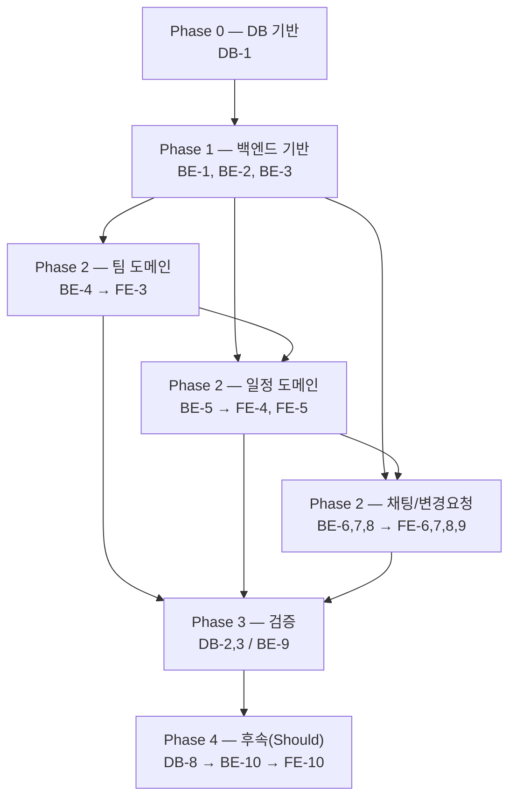

# Team CalTalk 실행 계획 (DB / 백엔드 / 프론트엔드)

## 문서 정보

| 항목 | 내용 |
|---|---|
| 버전 | v1.0 |
| 작성일 | 2026-09-07 |
| 작성자 | Team CalTalk 실행계획 수립 |
| 근거 문서 | [1-domain-definition.md](./1-domain-definition.md) (v1.4) [2-PRD.md](./2-PRD.md) (v1.0) [3-User-scenarios.md](./3-User-scenarios.md) [4-project-structure.md](./4-project-structure.md) (v1.1) [6-tech-stack.md](./6-tech-stack.md) (v1.0) [7-erd.md](./7-erd.md) (v1.1) [database/schema.sql](../database/schema.sql) |

## 0. 개요

본 문서는 docs/ 디렉토리의 모든 산출물(도메인 정의 → PRD → 시나리오 → 아키텍처 → 기술스택 → ERD → DDL)을 근거로, 데이터베이스/백엔드/프론트엔드 3개 트랙의 남은 작업을 독립적이고 관리 가능한 Task로 분해한 실행 계획이다. 각 트랙은 해당 분야 전문 서브에이전트(postgres-pro, backend-developer, frontend-developer)가 병렬로 수립했으며, 본 문서는 그 결과를 하나의 계획으로 종합하고 트랙 간(cross-track) 의존성과 실행 순서를 정리한다.

**범위 구분**: PRD 5장 기준 Must(MVP) = UC1-UC8 + 팀 라이프사이클, Should(후속) = UC9(일정 충돌 감지). 아래 모든 트랙에서 이 경계를 그대로 따른다.

**태스크 ID 체계**: DB-1~DB-8(데이터베이스), BE-1~BE-10(백엔드), FE-1~FE-10(프론트엔드). Should 항목은 각 트랙의 마지막 번호(DB-8, BE-10, FE-10)로 분리되어 있다.

---

## 1. 즉시 조치가 필요한 발견 사항 (해결됨)

실행계획 수립 과정에서 백엔드 트랙이 다음 블로커를 발견했다.

- **`users` 테이블에 로그인 자격증명 컬럼 누락**: `database/schema.sql`의 `users` 테이블은 `id`/`email`/`name`/`created_at`만 가지고 있고 비밀번호 해시 등 인증에 필요한 컬럼이 없었다. UC1(로그인/인증, BE-2)을 구현하려면 `users`에 자격증명 컬럼이 필요했다.
- **✅ 해결**: `database/schema.sql`(v1.1)에 `users.password_hash TEXT NOT NULL` 컬럼을 추가했다. `docs/7-erd.md`(v1.1)도 함께 갱신되어 SSOT와 실제 DDL이 다시 일치한다. 기존 스키마 설계(소프트 삭제, 캐스케이드 체인 등)는 변경하지 않은 순수 추가(additive) 변경이다. BE-2는 이제 이 블로커 없이 착수 가능하다.

---

## 2. 단계별 실행 순서 (Phase Roadmap)

- **Phase 0(DB 기반)**: DB-1이 모든 것의 최초 선행 조건. DB-4/DB-5/DB-6/DB-7은 DB-1 이후 병행 가능.
- **Phase 1(백엔드 기반)**: BE-1(스캐폴딩) → BE-2(인증, `users` 컬럼 보강 선결) → BE-3(권한 SSOT). 이 셋이 끝나야 이후 모든 도메인 API와 프런트엔드 착수가 가능.
- **Phase 2(도메인별 수직 슬라이스, 병행 가능하되 팀→일정→채팅 순으로 자연스러운 선행 관계 있음)**:
  - 팀: BE-4 → FE-3
  - 일정: BE-5 → FE-4, FE-5 (BE-4 이후)
  - 채팅/변경요청: BE-6, BE-7, BE-8 → FE-6, FE-7, FE-8, FE-9 (BE-5 이후)
- **Phase 3(검증)**: DB-2/DB-3(제약·캐스케이드 실동작 검증)는 Phase 0 직후 아무 때나 가능하지만 백엔드 통합 전에는 완료 권장. BE-9(테스트 하네스)는 BE-2~BE-8 진행과 병행하되 최종 커버리지 검증은 이들 완료 후.
- **Phase 4(Should 후속)**: DB-8(조사만) → BE-10 → FE-10. MVP 배포를 막지 않으며 별도 릴리스로 분리 가능.

---

## 3. 데이터베이스 트랙 (DB-1 ~ DB-8)

> 담당: postgres-pro | 산출물 기준: `docs/7-erd.md`, `database/schema.sql`, `docs/6-tech-stack.md` 4장

### DB-1. 로컬 PostgreSQL 개발 환경 구성 및 schema.sql 적용 자동화

**완료 조건**
- [ ] `docker-compose.yml`(또는 동등한 로컬 실행 수단)로 PostgreSQL 인스턴스가 한 명령으로 기동된다
- [ ] `CREATE EXTENSION IF NOT EXISTS pgcrypto;`가 오류 없이 실행되고 `gen_random_uuid()` 호출이 정상 동작함을 확인했다
- [ ] `schema.sql` 실행 시 오류 없이 8개 테이블과 모든 인덱스/제약이 생성됨을 `\dt`, `\d <table>`로 확인했다
- [ ] 스키마를 초기화하고 재적용(drop & recreate)할 수 있는 스크립트가 존재하며 반복 실행해도 동일한 결과를 낸다(멱등성)
- [ ] DB 접속 환경변수명(`DATABASE_URL` 등)이 정의되어 `.env.example` 반영 초안이 나왔다

**의존성**
- [ ] 없음(최초 시작 태스크)

**예상 규모**: M

---

### DB-2. 기본 제약조건(FK/UNIQUE/CHECK/부분 유니크 인덱스) 실동작 검증

**완료 조건**
- [ ] 팀 하나에 LEADER 역할 행 2개 삽입 시도 → 유니크 인덱스 위반으로 실패 확인
- [ ] 동일 `schedule_id`로 `chats` 2개 삽입 시도 → `uq_chats_schedule_id` 위반 확인
- [ ] `role`/`status`에 허용되지 않은 값 삽입 시도 → CHECK 위반 확인
- [ ] 동일 `(team_id, user_id)` 중복 삽입 시도 → 유니크 위반 확인
- [ ] 존재하지 않는 FK 참조 삽입 시도 → 모든 자식 테이블에서 FK 위반 확인
- [ ] 검증 결과가 재실행 가능한 스크립트로 저장소에 남아 회귀 검증에 재사용 가능하다

**의존성**
- [ ] DB-1

**예상 규모**: M

---

### DB-3. 조건부 CASCADE 체인(소프트 삭제 vs 팀 해체) 실동작 검증

**완료 조건**
- [ ] 시나리오 A(일정 소프트 삭제): 채팅/메시지 생성 후 `deleted_at` 갱신 → `chats`/`chat_messages` 그대로 존재 확인
- [ ] 시나리오 B(팀 해체): `DELETE FROM teams` → `schedules`/`schedule_participants`/`chats`/`chat_messages`/`change_requests`/`team_memberships` 모두 함께 삭제 확인
- [ ] 소프트 삭제가 CASCADE를 발동시키지 않음을 코드/제약 리뷰로 재확인, 애플리케이션이 실수로 hard delete 호출 시 리스크를 문서화
- [ ] 두 시나리오가 재실행 가능한 스크립트로 저장소에 남아있다

**의존성**
- [ ] DB-1

**예상 규모**: M

---

### DB-4. 개발용 시드/픽스처 데이터셋 작성

**완료 조건**
- [ ] 최소 2개 팀(다인원 팀 1개, 팀장 1인 팀 1개) 시드 포함
- [ ] 각 팀에 정확히 LEADER 1명 존재함을 재확인
- [ ] 과거/현재/미래 일정이 섞인 데이터 포함(SC1 검증용)
- [ ] 소프트 삭제된 일정 최소 1건 포함, 해당 채팅 이력 조회 가능함을 보여줌
- [ ] `change_requests`가 PENDING/APPROVED/REJECTED 각 상태별 최소 1건
- [ ] 시드 스크립트가 멱등적으로 적용 가능하다
- [ ] 시드 적용 후 행 수/불변조건 점검 스크립트 제공

**의존성**
- [ ] DB-1
- [ ] (권장) DB-2, DB-3

**예상 규모**: M

---

### DB-5. 마이그레이션 전략 판단 및 최소 도구 도입 여부 결정

**판단**: MVP 단계에서 Prisma/TypeORM 같은 풀 프레임워크 도입은 과설계로 판단. 번호 매긴 순차 SQL 마이그레이션 파일 + 적용 이력 테이블이라는 경량 관례만 도입하고, 정식 도구 재검토는 배포 환경 도입 또는 잦은 스키마 변경 마찰 확인 시로 미룸.

**완료 조건**
- [ ] 위 판단이 팀이 참조 가능한 문서로 정리되어 있다
- [ ] 경량 마이그레이션 메커니즘(`database/migrations/0001_init.sql` 등)이 DB-1 인스턴스에 순서대로 적용 가능함을 확인
- [ ] `schema.sql`과 마이그레이션 파일 간 관계가 명확히 정의되어 있다
- [ ] 판단을 뒤집을 재검토 트리거(배포 환경 도입, 개발자 3인 이상 등)가 문서에 명시되어 있다

**의존성**
- [ ] DB-1

**예상 규모**: S

---

### DB-6. 백엔드 연동을 위한 DB 접속/사용 계약 문서화

**완료 조건**
- [ ] DB 접속 환경변수 목록과 `.env.example` 형식 문서화
- [ ] 8개 테이블 각각의 "소프트 삭제 컬럼 유무/CASCADE 발동 조건/부분 유니크 인덱스 보장 범위"가 표로 정리
- [ ] SC3 보장을 위해 백엔드가 단일 트랜잭션으로 묶어야 하는 두 작업이 명시적으로 경고되어 있다
- [ ] DB-5의 마이그레이션 방식이 반영되어 백엔드/CI가 재사용 가능하다
- [ ] `database/` 내 README 형태로 존재하여 백엔드 트랙이 참조 가능하다

**의존성**
- [ ] DB-1, DB-2, DB-3, DB-5
- [ ] 백엔드 트랙: ORM/쿼리 빌더 사용 여부 확정 필요(미확정 시 raw SQL 기준으로 작성 후 갱신)

**예상 규모**: S

---

### DB-7. 조회 패턴 기반 인덱스 점검 및 보완 (SC1/UC8 대응)

**완료 조건**
- [ ] "특정 팀의 특정 월 일정 조회" 쿼리에 `EXPLAIN ANALYZE` 실행 및 기록
- [ ] `chat_messages(chat_id, created_at)` 인덱스가 실제 사용됨을 `EXPLAIN`으로 확인
- [ ] `schedules`에 `(team_id, start_at)` 등 복합 인덱스 추가 여부 판단 및 필요 시 반영
- [ ] 판단 근거와 실행 계획 스냅샷 기록
- [ ] 백엔드 리포지토리 구현 후 쿼리 형태가 달라지면 재검증 필요함을 명시

**의존성**
- [ ] DB-1, DB-4, DB-5

**예상 규모**: M

---

### DB-8. (Should) UC9/SC4 대비 시간대 중첩 쿼리 패턴 사전 조사

**완료 조건**
- [ ] `tsrange` + `EXCLUDE USING gist` 방식 vs 애플리케이션 레벨 판정 비교 메모
- [ ] 현재 컬럼 구조로 "동일 사용자, 겹치는 시간대" 조회 가능 여부 확인(스키마 변경 없이)
- [ ] "충돌 감지 범위(같은 팀 한정 여부)" 오픈 이슈가 미해결임을 재확인, 해소 전 구현 착수하지 않음을 명시
- [ ] 산출물은 조사 메모이며 MVP 완료의 선행 조건이 아님을 명시

**의존성**
- [ ] DB-1

**예상 규모**: S

**DB 트랙 제외 항목(근거 문서에 없어 의도적 제외)**: 캐싱 레이어, 읽기 복제본, 백업/재해복구 전략, `chat_messages` 파티셔닝 DDL, 정식 백업 자동화.

---

## 4. 백엔드 트랙 (BE-1 ~ BE-10)

> 담당: backend-developer | 스택: Node.js + TypeScript + Express (docs/6-tech-stack.md) | 구조: docs/4-project-structure.md 6.2절 준수

### BE-1. 프로젝트 스캐폴딩 및 인프라 기초

**완료 조건**
- [ ] `backend/src/` 하위에 4-project-structure.md 6.2절과 동일한 4계층 디렉토리 생성
- [ ] `tsconfig.json`에 `strict: true`
- [ ] domain 계층에서 infrastructure/presentation import 시 오류 나는 ESLint 규칙 구성
- [ ] `infrastructure/config/env.ts`가 필수 환경변수 누락 시 프로세스 즉시 종료
- [ ] `.env.example` 커밋, `.env`는 `.gitignore`
- [ ] PostgreSQL 커넥션 풀 모듈 + `SELECT 1` 헬스체크 성공
- [ ] `GET /health`가 200과 DB 연결 상태 반환
- [ ] `npm run lint`/`build`/`test` 모두 오류 없이 실행
- [ ] `SIGTERM` graceful shutdown 구현

**의존성**
- [ ] DB-1 (cross-track)

**예상 규모**: M

---

### BE-2. 인증 (UC1)

**완료 조건**
- [ ] `POST /auth/register`, `POST /auth/login` 구현, 로그인 성공 시 Bearer 토큰 발급
- [ ] `auth.middleware.ts`가 토큰 검증, 미인증 요청은 애플리케이션 계층 도달 전 401 차단
- [ ] 모든 보호 라우트가 공통 미들웨어를 거치며 개별 컨트롤러가 재검사하지 않음
- [ ] `ws-auth.guard.ts`가 WebSocket 핸드셰이크 시점에 토큰 검증, 미인증 소켓 거부
- [ ] 잘못된 자격증명/만료·위조 토큰 시 401 테스트
- [ ] US-07(미인증 접근 차단) 검증 통합 테스트 — 보호된 엔드포인트 2개 이상 401 확인

**의존성**
- [ ] BE-1
- [ ] DB-1
- [x] ~~DB 트랙: `users` 자격증명 컬럼(예: `password_hash`) 추가 마이그레이션 필요~~ — schema.sql v1.1에서 해결됨 (1장 참조)
- [ ] 프런트엔드 `auth` feature(FE-2)가 이 API 계약에 의존 (cross-track, blocks FE)

**예상 규모**: M

---

### BE-3. 권한 정책 모듈 (SSOT)

**완료 조건**
- [ ] `domain/permission/permission.policy.ts`에 `canEditSchedule`, `canAccessTeamChat`, `canApproveChangeRequest` 구현, LEADER만 `true`
- [ ] 이 모듈이 domain 계층에 위치, infrastructure import 없음(정적 분석 확인)
- [ ] presentation/infrastructure 어디에도 권한 재판단 로직 복제 없음(코드 검색 확인)
- [ ] 팀원의 쓰기 API 호출 시 403 단위 테스트
- [ ] 팀원 아닌 사용자의 승인/거절 API 호출 시 403 단위 테스트

**의존성**
- [ ] BE-1

**예상 규모**: S

---

### BE-4. 팀 라이프사이클 API

**완료 조건**
- [ ] `POST /teams` — 생성자가 자동 LEADER로 `team_memberships` 등록
- [ ] 팀원 초대는 팀장만 가능(팀원 시도 시 403)
- [ ] `POST /teams/:id/join` — 인증된 사용자가 MEMBER로 가입
- [ ] `POST /teams/:id/leave` — 탈퇴 후 해당 팀 조회/변경요청 API가 403이 됨을 검증
- [ ] 팀장 위임 API — 단일 트랜잭션 내 기존 LEADER→MEMBER, 대상→LEADER, 종료 시점 정확히 1명 LEADER 검증
- [ ] 유일 팀원(팀장)의 탈퇴 시 팀 해체 경로 실행, 관련 데이터 함께 삭제 확인(통합 테스트)
- [ ] 위임 대상 없이(다른 팀원 존재) 탈퇴 시도 시 409 + "사전 위임 필요" 에러
- [ ] 위임 수락 절차 없음(즉시 발효) 결정을 코드 주석/PR에 명시(PRD 8장 오픈이슈 임시 처리)
- [ ] `team-lifecycle.rules.ts` 단위 테스트가 각 전이마다 "정확히 1명 LEADER" 불변조건 검증

**의존성**
- [ ] BE-1, BE-2, BE-3
- [ ] DB-1
- [ ] 프런트엔드 `team` feature(FE-3)가 이 API 계약에 의존 (cross-track)

**예상 규모**: L

---

### BE-5. 일정 조회/CRUD (UC2-4, SC1)

**완료 조건**
- [ ] `GET /teams/:teamId/schedules?view=...` 조회 로직에 기간 상/하한 제한이 코드 어디에도 없음(SC1 단위 테스트)
- [ ] 과거/현재/미래 일정이 한 응답에 모두 포함되는 통합 테스트(SC1, US-08)
- [ ] `POST /teams/:teamId/schedules` — 팀장만 가능(팀원 403), 제목/시작·종료/참여자 목록 처리
- [ ] 일정 생성 시 단일 트랜잭션 내 `chats` 행 함께 생성(일정 1:1 채팅)
- [ ] `PUT`/`DELETE` — 팀장만 가능, 삭제는 `deleted_at` 갱신(소프트 삭제)으로 구현
- [ ] 소프트 삭제 후에도 `chats`/`chat_messages` 조회 가능(SC2 통합 테스트)
- [ ] 소프트 삭제된 일정은 캘린더 목록에서 제외
- [ ] 등록된 일정이 팀 전체 구성원 조회 응답에 노출(UC4)

**의존성**
- [ ] BE-1, BE-2, BE-3, BE-4
- [ ] DB-1
- [ ] 프런트엔드 `calendar` feature(FE-4, FE-5)가 이 API 계약에 의존 (cross-track)

**예상 규모**: L

---

### BE-6. 채팅 도메인 및 이력 조회 REST (UC8, SC2)

**완료 조건**
- [ ] `GET /schedules/:scheduleId/messages`가 페이지네이션 파라미터 필수(무제한 반환 없음)
- [ ] 팀 비소속 사용자 호출 시 403
- [ ] 메시지가 `created_at` 오름차순으로 순서 보존됨(SC2)
- [ ] 일정 소프트 삭제 후에도 채팅 이력 조회가 200과 기존 메시지 반환(SC2, BE-5 연계)
- [ ] 팀 해체 후 해당 채팅 이력 조회가 404 반환(SC2 예외 조항)
- [ ] `chat.repository` 인터페이스는 domain, PostgreSQL 구현은 infrastructure(2.2 원칙 준수)

**의존성**
- [ ] BE-1, BE-2, BE-3, BE-5
- [ ] DB-1

**예상 규모**: M

---

### BE-7. 실시간 채팅 WebSocket (UC5)

**완료 조건**
- [ ] WebSocket 연결 시 `ws-auth.guard.ts` 토큰 검증, 미인증 소켓 거부
- [ ] 인증된 소켓이 특정 `schedule_id` 채널 구독 가능, 팀 비소속 구독 시도 거부
- [ ] 메시지 전송 시 권한 판단 후 영속화 및 동일 채널 구독자에게 실시간 브로드캐스트(US-03)
- [ ] `chat.gateway.ts`는 페이지네이션 조회를 처리하지 않고 BE-6과 책임 분리(5.4)
- [ ] DB 저장 성공 후에만 브로드캐스트(SC2 유실 방지)

**의존성**
- [ ] BE-1, BE-2, BE-3, BE-6
- [ ] DB-1
- [ ] 프런트엔드 `chat` feature(FE-6)의 `use-chat-socket.ts`가 이 WS 계약에 의존 (cross-track)

**예상 규모**: M

---

### BE-8. 변경 요청 승인 워크플로우 (UC6/UC7, SC3)

**완료 조건**
- [ ] `POST /schedules/:scheduleId/change-requests` — 참여자로 등록된 팀원만 요청 생성 가능(비참여자 403)
- [ ] 요청 생성 시 `status=PENDING`, 이 시점에 `schedules` 컬럼 변경 없음(SC3 단위 테스트)
- [ ] `POST /change-requests/:id/approve` — 팀장만 가능(팀원 403), `PENDING` 아니면 409
- [ ] 승인은 단일 트랜잭션으로 `status→APPROVED`와 `schedules` 갱신을 원자적으로 수행, 실패 시 모두 롤백(SC3 통합 테스트)
- [ ] `POST /change-requests/:id/reject` — 팀장만 가능, `reason` 필수, `status=REJECTED`, `schedules` 변경 없음
- [ ] 승인/거절 결과가 해당 일정 채팅에 시스템 메시지로 기록되어 BE-6로 조회 가능(UC7)
- [ ] 거절 후 재요청 가능, 이전 요청과 무관한 새 독립 행으로 생성(US-05)
- [ ] `approve/reject-change-request.usecase.ts` 변경 PR이 최소 1인 리뷰 대상으로 표시

**의존성**
- [ ] BE-1, BE-2, BE-3, BE-5, BE-6
- [ ] DB-1
- [ ] 프런트엔드 `chat` feature(FE-8, FE-9)가 이 API 계약에 의존 (cross-track)

**예상 규모**: L

---

### BE-9. 테스트 하네스 및 품질 게이트

**완료 조건**
- [ ] `tests/unit/`, `tests/integration/` 폴더 구성(6.2절)
- [ ] Jest 등 테스트 러너 설정, `npm test`로 단위+통합 테스트 실행
- [ ] 통합 테스트가 격리된 테스트 DB에서 실행되고 종료 후 데이터 정리
- [ ] CI가 PR마다 lint→build→unit→integration 순 실행, 실패 시 머지 차단
- [ ] domain 계층 커버리지 80% 이상
- [ ] SC1-SC4 각각 대응 단위 테스트가 최소 1개 이상 존재함을 매핑 목록으로 확인
- [ ] US-04(승인 전체 흐름), US-07(미인증 차단) 대표 통합/E2E 테스트 최소 2건
- [ ] BE-1의 레이어 의존성 방향 ESLint 규칙이 CI에도 포함

**의존성**
- [ ] BE-1 (선행), BE-2~BE-8(개별 테스트는 병행 가능, 종합 커버리지 검증은 완료 후)

**예상 규모**: M

---

### BE-10. (Should) 일정 충돌 감지 (UC9, SC4)

**완료 조건**
- [ ] `domain/schedule/schedule-conflict.ts` 순수 함수, infrastructure/외부 API import 없음
- [ ] 동일 참여자 시간대 겹침/비겹침 판정 단위 테스트(경계값 포함)
- [ ] 충돌 감지 범위는 "동일 팀 내 한정"으로 구현, PRD 8장 오픈이슈에 대한 명시적 가정임을 주석/PR에 명시
- [ ] 저장 시 충돌 감지되어도 200/201 응답, 저장은 성공(SC4)
- [ ] 비충돌 시 경고 필드 비어있음 테스트
- [ ] 모듈 비활성화해도 BE-5 흐름 정상 동작(1.6 가역적 결정)

**의존성**
- [ ] BE-5, BE-9
- [ ] MVP(BE-1~BE-9) 완료와 무관하게 독립 착수 가능

**예상 규모**: M

---

## 5. 프론트엔드 트랙 (FE-1 ~ FE-10)

> 담당: frontend-developer | 스택: React 18 + TypeScript SPA (Vite) | 구조: docs/4-project-structure.md 6.1절 준수

### FE-1. 프로젝트 스캐폴딩 (Vite + React + TS, features 구조)

**완료 조건**
- [ ] `frontend/src/app`, `features/{auth,team,calendar,chat}`, `shared/{components,hooks,api,types}`, `styles`, `tests` 디렉토리가 6.1절과 동일하게 생성
- [ ] `npm run build`, `npm run lint` 초기 상태 통과
- [ ] TypeScript strict 모드 설정
- [ ] `.env.example` 존재, `.env`는 `.gitignore`
- [ ] 컴포넌트 PascalCase(.tsx), 훅 `use-` 접두사 kebab-case(.ts) 네이밍 규칙이 ESLint/컨벤션 문서로 강제·명시
- [ ] `shared/types/`에 `Team`, `Schedule`, `ChatMessage`, `ChangeRequest` 타입 뼈대 정의

**의존성**
- [ ] 없음

**예상 규모**: M

---

### FE-2. 인증 화면 + 라우트 가드 (UC1)

**완료 조건**
- [ ] 미인증 상태로 보호 경로 접근 시 로그인 화면으로 리다이렉트
- [ ] 로그인 성공 시 토큰/세션 저장 및 보호 경로 진입 가능
- [ ] 로그인 실패 시 오류 메시지 표시, 인증 상태 되지 않음
- [ ] 인증 컨텍스트가 현재 사용자 정보/인증 여부를 전역 제공
- [ ] 라우트 가드 로직 단위/컴포넌트 테스트(인증/비인증 각각)

**의존성**
- [ ] FE-1
- [ ] 백엔드 트랙: 로그인/인증 API(BE-2) 필요

**예상 규모**: M

---

### FE-3. 팀 라이프사이클 UI (생성/초대/가입/탈퇴/위임)

**완료 조건**
- [ ] 팀 생성 시 본인이 팀장으로 표시
- [ ] 팀장이 팀원 초대 가능, 초대받은 사용자 가입 후 목록 반영
- [ ] 구성원 목록에서 역할(팀장/팀원) 구분 표시
- [ ] 탈퇴 시 해당 팀 일정/채팅 접근 불가
- [ ] 팀장 위임 수행 시 역할 전환이 즉시 화면 반영
- [ ] 유일 팀원(팀장)만 남은 상태에서 탈퇴 시도 시 팀 해체 안내 표시
- [ ] 팀장이 아닌 사용자에게 초대/위임/구성원 관리 버튼 미노출

**의존성**
- [ ] FE-1, FE-2
- [ ] 백엔드 트랙: 팀 라이프사이클 API(BE-4) 필요

**예상 규모**: L

---

### FE-4. 캘린더 뷰 (월/주/일, 역할별 분기) — UC2, UC4

**완료 조건**
- [ ] 월/주/일 3가지 보기 전환 가능
- [ ] 조회 요청에 기간 제한 하드코딩 없음(과거/현재/미래 전체 대상)
- [ ] 팀원 계정에는 일정 생성 버튼 미노출, 팀장 계정에는 노출
- [ ] 일정 클릭 시 상세/채팅 패널로 이동
- [ ] 로딩/빈 상태/오류 상태 화면 분기 존재

**의존성**
- [ ] FE-1, FE-2, FE-3
- [ ] 백엔드 트랙: 팀 일정 목록 조회 API(BE-5, SC1) 필요

**예상 규모**: L

---

### FE-5. 일정 생성/수정/삭제 UI (팀장 전용) — UC3

**완료 조건**
- [ ] 팀장이 제목/시작·종료일시/참여자 입력 후 생성 시 캘린더에 즉시 반영
- [ ] 수정 시 변경사항 저장 및 캘린더 반영
- [ ] 삭제 시 캘린더에서 제거
- [ ] 팀원 계정으로는 생성/수정/삭제 액션 미제공(직접 접근 시도 포함)
- [ ] 필수 필드 누락 시 저장 차단 및 검증 메시지
- [ ] 시작일시 > 종료일시인 경우 저장 차단

**의존성**
- [ ] FE-4
- [ ] 백엔드 트랙: 일정 생성/수정/삭제 API + 서버 측 권한 검사(BE-5) 필요

**예상 규모**: M

---

### FE-6. 채팅 패널 + WebSocket 훅 (UC5)

**완료 조건**
- [ ] 일정 선택 시 상세와 채팅 패널이 같은 화면에 표시
- [ ] 메시지 전송 시 같은 일정 채팅을 보는 다른 사용자 화면에 실시간 반영
- [ ] 인증 토큰 없음/만료 시 소켓 연결/송수신 차단
- [ ] 소켓 끊김 시 재연결 시도 또는 연결 상태 안내
- [ ] `use-chat-socket.ts`가 실시간 송수신만 담당, 이력 페이지네이션(FE-7)과 책임 분리

**의존성**
- [ ] FE-4, FE-2
- [ ] 백엔드 트랙: WebSocket 게이트웨이+핸드셰이크 인증(BE-7) 필요

**예상 규모**: L

---

### FE-7. 채팅 이력 조회 UI (페이지네이션) — UC8

**완료 조건**
- [ ] 채팅 패널을 열면 최신 메시지부터 시간순 표시
- [ ] 스크롤/버튼으로 이전 메시지 추가 로드(요청에 페이지네이션 파라미터 포함)
- [ ] 과거(수개월 전) 일정 채팅도 유실 없이 순서대로 표시(US-08)
- [ ] 메시지 없는 신규 일정은 빈 상태 UI
- [ ] 로딩/오류 상태 화면 분기 존재

**의존성**
- [ ] FE-6
- [ ] 백엔드 트랙: 채팅 이력 페이지네이션 REST API(BE-6) 필요

**예상 규모**: M

---

### FE-8. 변경 요청 작성 UI (팀원) — UC6

**완료 조건**
- [ ] 참여자로 등록된 일정의 채팅에서만 요청 작성 진입점 노출
- [ ] 비참여자 일정에는 미노출
- [ ] 제출 시 희망 시작/종료일시+사유가 채팅에 요청 형태로 표시
- [ ] 제출 직후 원래 일정 정보는 캘린더에서 변경되지 않음(SC3)
- [ ] 거절 후 재요청 가능

**의존성**
- [ ] FE-6
- [ ] 백엔드 트랙: 변경 요청 제출 API(BE-8) 필요

**예상 규모**: S

---

### FE-9. 변경 요청 승인/거절 UI (팀장) — UC7

**완료 조건**
- [ ] 팀장 계정에만 승인/거절 버튼 렌더링
- [ ] 팀원 계정에는 미노출
- [ ] 승인 시 일정 시작/종료일시가 갱신되어 캘린더(FE-4)에 반영
- [ ] 거절 시 사유 입력 필수, 거절 사유가 채팅으로 통지된 형태로 표시
- [ ] 거절된 요청은 원래 일정 정보 변경 없음
- [ ] 중복 클릭 등으로 동일 요청이 두 번 처리되지 않도록 방지(처리 후 버튼 비활성화)

**의존성**
- [ ] FE-6, FE-8
- [ ] 백엔드 트랙: 변경 요청 승인/거절 API(BE-8, SC3 핵심) 필요

**예상 규모**: M

---

### FE-10. (Should) 일정 충돌 경고 배너 — UC9

**완료 조건**
- [ ] 참여자 시간대가 겹치는 일정 저장 시도 시 저장 시점에 경고 배너 표시
- [ ] 경고 상태에서도 저장 버튼으로 저장 완료 가능(차단 없음)
- [ ] 시간대 미겹침 시 경고 미표시, 정상 저장
- [ ] 이 배너/훅 없이 빌드해도 FE-5 핵심 흐름 정상 동작(느슨한 결합 확인)

**의존성**
- [ ] FE-5
- [ ] 백엔드 트랙: 일정 충돌 감지 API/응답 필드(BE-10) 필요

**예상 규모**: S

---

## 6. 전체 Cross-track 의존성 요약

| 트랙 | 태스크 | 막고 있는 대상 |
|---|---|---|
| DB → 백엔드 | DB-1 | BE-1, BE-4~BE-8, BE-10 (모든 DB 접근 태스크) |
| DB → 백엔드 | ~~`users` 자격증명 컬럼(1장 발견 사항)~~ — 해결됨 | (BE-2 블로커 아님) |
| 백엔드 → 프론트 | BE-2 (인증 API) | FE-2 |
| 백엔드 → 프론트 | BE-4 (팀 API) | FE-3 |
| 백엔드 → 프론트 | BE-5 (일정 API) | FE-4, FE-5 |
| 백엔드 → 프론트 | BE-7 (WebSocket) | FE-6 |
| 백엔드 → 프론트 | BE-6 (채팅 이력 API) | FE-7 |
| 백엔드 → 프론트 | BE-8 (변경요청 API) | FE-8, FE-9 |
| 백엔드 → 프론트 | BE-10 (충돌 감지 API) | FE-10 |

**권장**: 각 백엔드 태스크는 구현 완료를 기다리지 않더라도 요청/응답 스키마(API 계약)만 먼저 확정해 프론트엔드 트랙과 공유하면, 두 트랙을 병렬로 진행할 수 있다.

---

## 7. 범위 밖 (의도적 제외)

아래는 근거 문서(도메인정의서/PRD/6-tech-stack.md/7-erd.md) 어디에도 요구사항이 없어 이번 실행계획에 포함하지 않았다: 캐싱 레이어, 읽기 복제본, 백업/재해복구 전략, `chat_messages` 파티셔닝 DDL, 정식 CI/CD 배포 파이프라인 구체 설계, 외부 캘린더 연동, 앱 외부 알림(이메일/푸시), 결제/구독, 화상회의/파일공유, 반복 일정.
